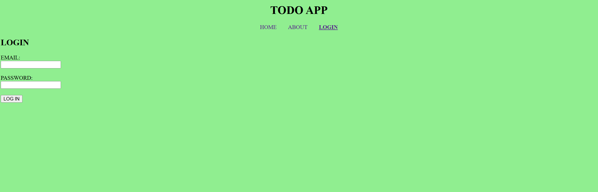
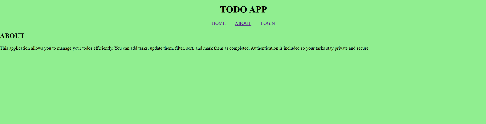
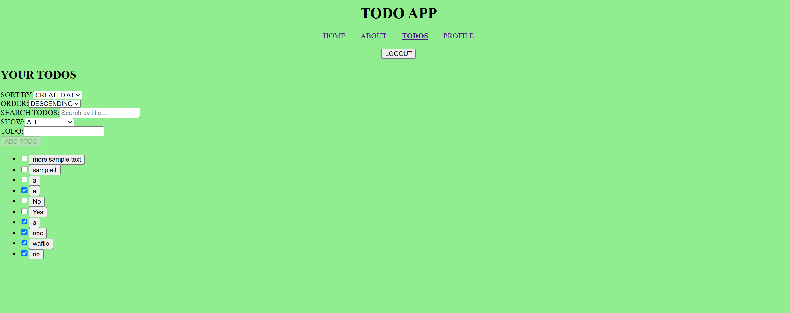
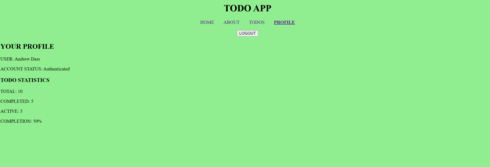

# To-Do-List Application

## Project Description
This repository contains files that will start a To-Do Application. It is made in JavaScript and the front-end framework React.js. The user can add todo items to their list they can make, and then can either sort the items in alphabetical order or when they were created in history, from oldest to newest or newest to oldest. The list can also be sorted to show all items, or filter out to show only completed items or items that need to be completed. There are many options on the todo app that allow these options for the user to edit and change their list.

## Features List
The todo app is capable of sorting its items by doing the following:
* "Created By" or "Title": Categorizes items from when they were created in time or by title or their wording
* Order in DESCENDING or ASCENDING: Categorize items in alphabetical order
* Search Todos: There is a text box that if a user types in a letter or an exact word, it will filter the todos that either contain the letter or word that was typed in
* Show: Gives the user an option to show every todo, or only todos that are completed or todos that are not completed. 
* Todo: This text box allows users to add todos to the list. When todos are added, the user can click on the todo text to modify the text.
* The user can checkmark a todo to make an active todo into a completed todo. They cannot uncheck the todo once it has been marked.
* This app only allows a max of 10 todos in a list, so if a new todo is added when there are 10 items, then one existing item will be removed. 

## Technologies Used
* JavaScript - The programming language used to create this application
* Git (1) - Source control to make and keep versions of the code when updated throughout the days or weeks
* npm - node package manager (2) - A software tool used to download and run React.js files easier and faster
* React.js (3) - A JavaScript front-end framework used to create the application. This framework was used in particular for its specific built-in libraries that was imported. 
* React.js Libraries:
    * useState - Manages, keeps, and modifies the current values of JavaScript functions in many files. When the files renders, then useState was used to update accordingly to rendering.
    * useRef - References certain values that was not updated during rendering.
    * useNavigation - This module allows to access different webpages by using the nav tags
    * useEffect - Add additional side effects to components when interacting with them
    * useLocation - Retrieve a location's object
    * useAuth - Enables and checks for a user's authentication is correct when trying to sign in
* vite - Was downloaded to run and use, vite.config.js, which changed the default port to run this app on 3000. 
* HTML - index.html is used to support React.js file structure
* CSS - Style React.js components


## Getting Started
To get started running this application, this sections explains what additional files was added to the basic React.js template to make this application functional and explains how to download this entire repository's files and code in order to run it.<br> <br>

First the user must install Git (1), a source code manager. All the files in this repository can be downloaded by using Git commands in the Terminal and to perform Git commands, the software must be installed onto a user's computer. Please go to the git website for further instructions to download it for a specific OS. <br> <br>

To replicate this project on your local machine, have the npm package installed already, which can be downloaded from the Node.js website (2). There are also specific instructions to download Node.js for each operating system. The files' code in this directory has been modified to display a To-Do app instead of showing the standard React and Vite documentation. 

To download and run these files, the npm package will be needed to structure the files in the correct places and to also download existing dependecies. The commands "install" and "run dev" need to be run with npm. (4)
<br> <br>
The first command that can be used is "npx create-next-app@latest". This will install React.js in a directory. The files that come with this are a configured index.html, package-lock.json, package.json, a "node_modules", "public" and "src" directories. <br> <br>

Since this repository already has React.js files and dependencies installed, to run these exact same files from this repository and to display the To-Do app, navigate to an empty folder or directory on the local machine and run the following command to first download these files:

```
git clone https://github.com/AndrewDass1/starting-react-project.git
```
The command above will download all the files onto a local machine's repository to display the To-Do App. Take note of the directory where the files was downloaded to, and if needed use the `cd` command to change directories on the local machine where the source code was downloaded. After successfully downloading the source, now run the following command:

```
npm install
```

npm install runs all required dependencies to run the source code for the To-Do app. The user can press enter for all questions the prompt asks the user to choose from in order to use default settings to run a React.js application.

If needed, go to the official React (3) website for further instructions to download React.js.

After downloading the code it will be asked to run the application after completing installation from running the code in the terminal. If the server is exited after the initial installation, to rerun the program at any time in the terminal, use the following code:

```
npm run dev
```
Below shows the homepage or the login page, of the application:


## Available Scripts
In this repository, the basic files from running the React commands to download the basic template of React, is used to run this application. Furthermore, additional files or scripts have been added in the src folder. Within the src folder, there are more added folders: components, contexts, features, pages, reducers, shared, and utils. 
<br> <br>
In the components and contexts folders have the RequireAuth.jsx and AuthContext.jsx files respectively, and they are used to provide authenciation when a user signs in into the todo app.   
<br> <br>
The features directory has the Logoff.jsx, where that file implements a "Logout" button on the website for when the user wants to log out of their todo list when finished. There is a "Todos" directory that has TodoForm.jsx and a "TodoList" directory. The TodoForm.jsx receives components from other files, including TextInputWithLabel.jsx and todoValidation.js to display a function todo form for users to interact with. In the TodoList directory, has files "TodoListItem.jsx" and "TodoList.jsx". "TodoListItem.jsx" adds items and sends it over to "TodoList.jsx".
<br> <br>
The pages directory has more .jsx files that displays to the HTML todo application's UI: "AboutPage.jsx", "HomePage.jsx", "LoginPage.jsx", "NotFoundPage.jsx", "ProfilePage.jsx" and "TodosPage.jsx". When first opening the website, the user is automatically directed to the homepage, which is the "HomePage.jsx". The "LoginPage.jsx" is structured the sameway as "HomePage.jsx". The "AboutPage.jsx" shows a description of this application and how to use it. These pages can be accessed through the header links by either clicking "HOME", "ABOUT" or "LOGIN" for which page the user wants.
<br> <br>

When the user logs into the application, their todolist is now shown and this is displayed from the "TodosPage.jsx". The header now shows: "HOME", "ABOUT", "TODOS", or "PROFILE". When the "HOME" link is now clicked, it also now shows this todolist page as well. The "ABOUT" page still shows a description of the application and how to use it and the "PROFILE" page shows percentage statistics of completed and uncompleted items to the total items on the list. There is also a "Logout" button at the top to sign out when the user is finished using the todo app.

Once again, to download all these files, its recommended and is more efficent to download the npm software onto a computer and run: `npx create-next-app@latest`. This will give the current directory a basic React.js structure layout to run the React.js framework. 

If the user chooses to download all the files from this directory, then it is recommended to run `npm install` to download the prerequisite packages that was used and customized for this project. If `npm install` was used, then run the `npm build` command to install and run the downloaded software. To run the app, in the web browser, use the command `npm run dev`. For further instructions to run React.js apps, refer to the official React website. 

## Screenshots
Below shows other pages of the application <br>

### About Page

This page shows a description of the todo app and how it can be used.
<br>

### Todo Page

<br>
The todo page can show all the todos that were or are on the list that was or need to completed respectively. There are different options to either show all items, only completed items or only the items that need to be completed. 

### Profile Page

This page shows the amount of total items on the list, and the ones that are either completed or need to be completed.

## Live Demo Link
I did not deploy this app, though I created a short video titled "Andrew Dass To-Do Application.mp4" that is in this repository, showing how the application works. This video can also be accessed through this link: https://youtu.be/10q-GLYtoqI

## Design Decisions
This application is meant to have a simple UI, where the user can see and navigate this application easily when they run it. When they first run the application, they are prompted to enter their login credentials. If they want to explore other parts of the website, the header is included at the top to show or navigate through other webpages. I customized the background to be a light green color, and the text's font and color is changed to Arial and gray respectively. The buttons on the website have also changed, where the font color is purple, the background of the button is lightblue and the button's text is also Arial. If the user hovers the mouse over the button, the button's background color changes to a light yellow.  

## Future Improvements
Improvements that can be done to this app, is, next time, I'll implement more features such as displaying the time and date of when a particular todo item was added to the list. Also, when an item is checked marked, I would implement for it to be unchecked and if an item needs to be removed or deleted, I would implement that as well. 

## Contact Information
Below is my Github profile: https://github.com/AndrewDass1 <br>

Below is my LinkedIn, if you want to contact me:
https://www.linkedin.com/in/andrewdass/

## Sources
https://git-scm.com/ (1)

https://nodejs.org/en/download (2)

https://react.dev/learn/installation (3)

https://react.dev/learn/creating-a-react-app (4)

## License Information
SPDX-License-Identifier: MIT  <br>
Source: https://github.com/react/react/blob/main/LICENSE (5)