# Project Title: To-Do-List Application

## Project Description
This repository contains files that will start a To-Do Application. The user can add, update, complete, or remove todo items to their list that they make. The items can also be sorted in alphabetical order or the time they were created. The user can also search for items in their list, and sort the list to show either all items, completed items or all uncompleted items.

## Live Demo Link
I did not deploy this app since the assignment stated that deployment is optional. There is no live demo link for this application. 

## Features List
* Has a header that contains links to the following pages: Home, About, and Login
  * The home page, shows whether the user is logged in or not into the application. Has a button to redirect to the home page too.
  * About page shows a description of how this app works
  * Login page is where the user enters their credentials to access their todo list
* When the user logs in, the header changes to:
  * Home - Now this page redirects the user to the webpage that contains their todolist
  * About - Still gives a description of how this app works
  * Todos - The webpage that contains the user's todolist.
  * Profile - Shows statistics of how many items, completed or not is available from the total amount of shown data or items
* The Todos page has these options down below:
* "Created By" or "Title": Categorizes items from when they were created in time or in chronological order by their wording
* Order in DESCENDING or ASCENDING: Categorize items in alphabetical order
* Search Todos: There is a text box that if a user types in a letter or an exact word, it will filter the todos that either contain the letter or word that was typed in
* Show: Gives the user an option to show every todo, completed todos or uncompleted todos. 
* Todo: This text box allows users to add todos to the list. When todos are added, the user can click on the todo text to modify the text.
* The user can checkmark a todo to make an active todo into a completed todo. They can uncheck the todo once it has been marked.
* This app only allows a max of 10 todos in a list, so if a new todo is added when there are 10 items, then one existing item will be removed. 
* If an error occurs in the application, the user may be directed to the "PAGE NOT FOUND" page.
* After a few minutes of inactivity, the user is automatically logged out.

## Technologies Used
* JavaScript - The programming language used to create this application
* Git (1) - Source control to make and keep versions of the code when updated throughout the days or weeks
* npm - node package manager (2) - A software tool used to download and run React.js files easier and faster
* React.js (3) - A JavaScript front-end framework used to create the application. This framework was used in particular for its specific built-in libraries that was imported. 
* React.js Libraries:
    * useState - Manages, keeps, and modifies the current values of JavaScript functions in many files. When the files renders, then useState was used to update accordingly to rendering.
    * useRef - References certain values that was not updated during rendering.
    * useNavigation - This module allows to access different webpages by using the nav tags
    * useEffect - Add additional side effects to components when interacting with them
    * useLocation - Retrieve a location's object
    * useAuth - Enables and checks for a user's authentication is correct when trying to sign in
* vite - Was downloaded to run and use, vite.config.js, which changed the default port to run this app on 3001. 
* HTML - index.html is used to support React.js file structure
* CSS - Style React.js components

## Screenshots
Below shows pages of the application on desktop and mobile: <br>

**Home Page** <br>
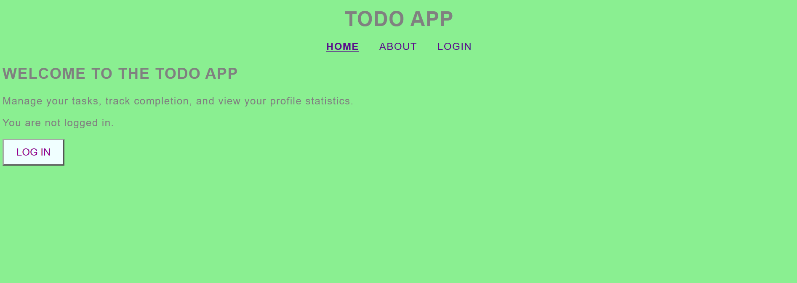

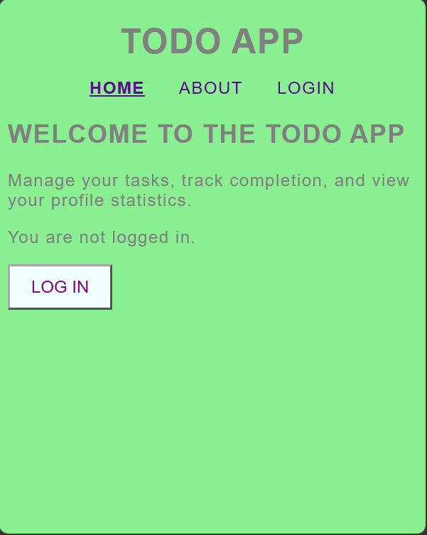

This page shows the first page or the homepage of the application when the user starts running the application. Clicking the "LOG IN" button redirects them to the "LOGIN" page. If they are signed in to the todoapp, then this page changes. 

**About Page** <br>
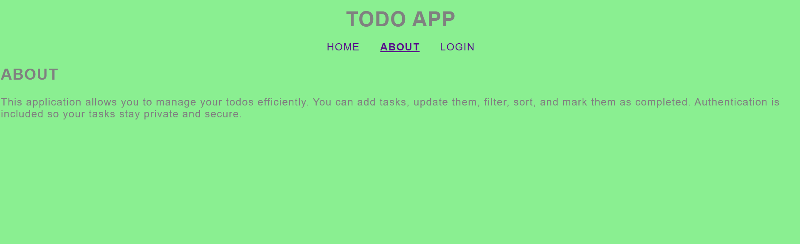

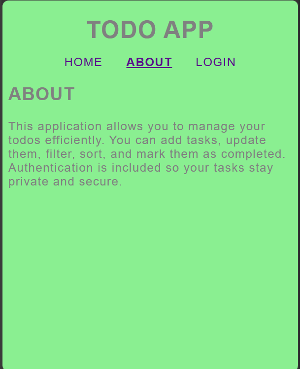

This page shows a description of the todo app and how it can be used.
<br>

**Login Page** <br>
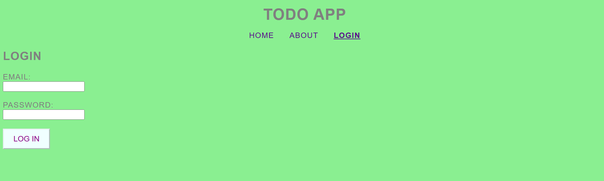

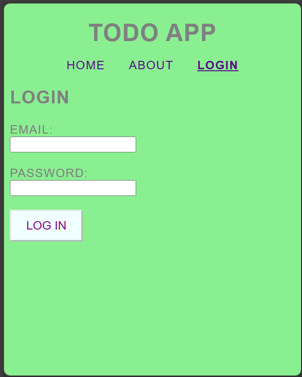
<br>
This page shows where the user can enter their credentials and clicking the "LOG IN" button on this page will make them access the application.

**Home Page Logged In** <br>
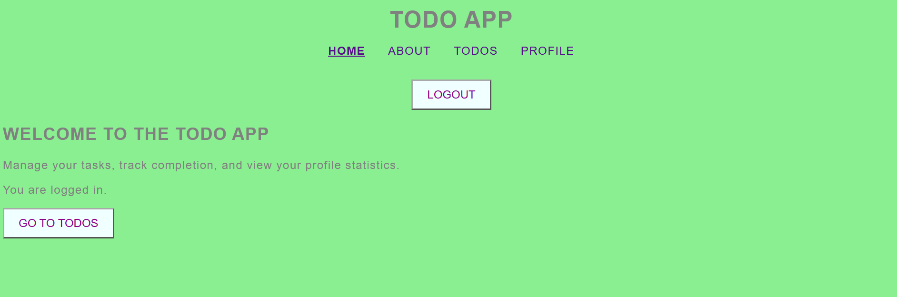

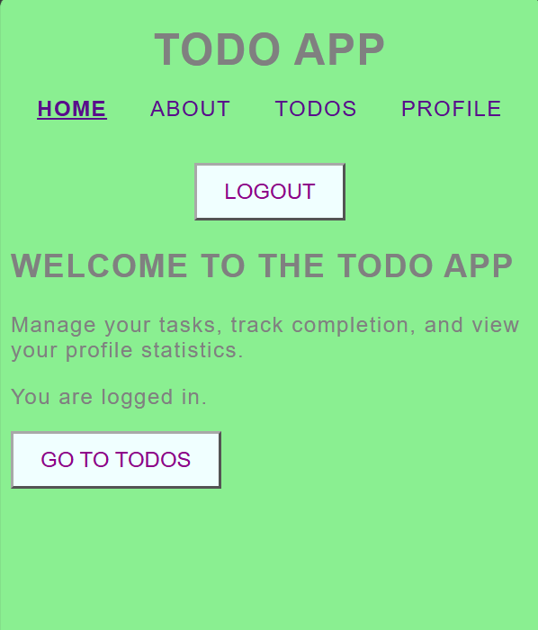

**Todo Page** <br>
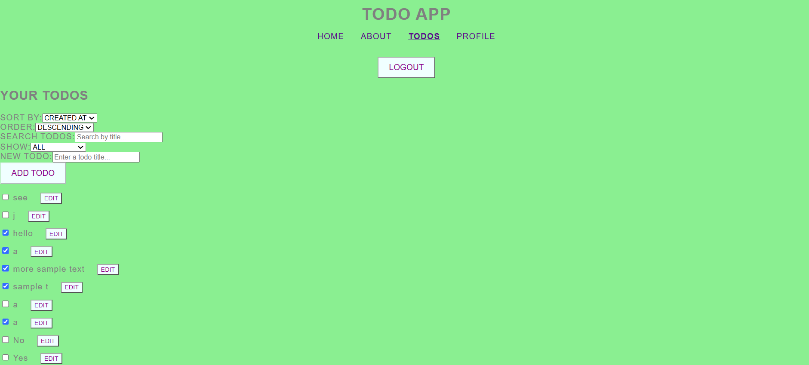

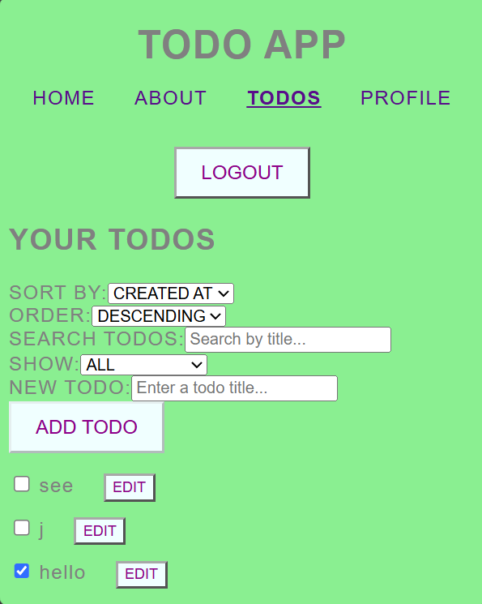

The todo page can show all the todos that were or are on the list that was or need to completed respectively. There are different options to either show all items, only completed items or only the items that need to be completed. 

**Profile Page** <br>
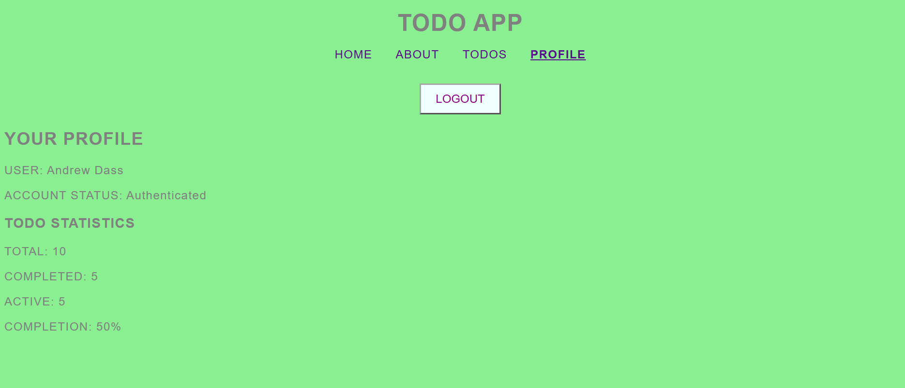

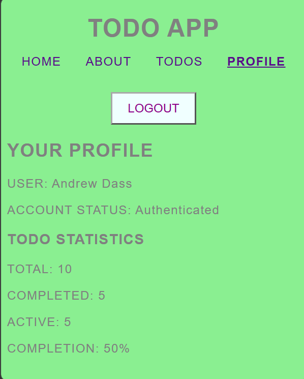

This page shows the amount of total items on the list, and the ones that are either completed or need to be completed.

**Not Found Page** <br>
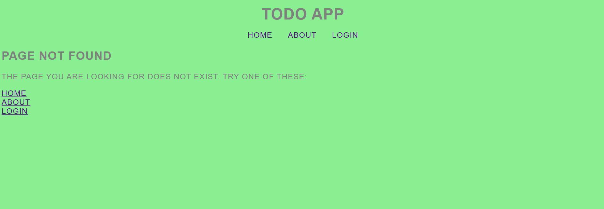

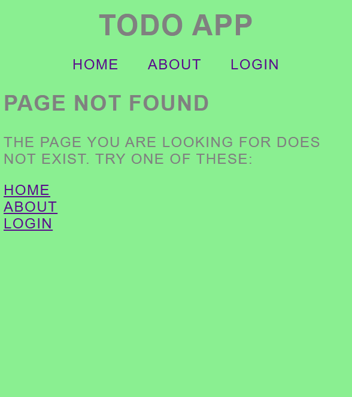

This page is shown when an error occurs in the application. The user is then recommended to either the Home, About or Login page, and the user has to sign in again. 

## Getting Started
To run this application, additional files is added to the basic React.js template to make it functional. To download this entire repository's files, install the Git (1) on the local machine. All the files in this repository can be downloaded by using and performing Git commands in the Terminal. Please go to the git website for further instructions to download it for a specific OS. <br>

Since this repository already has React.js files and dependencies installed, to run these exact same files from this repository and to display the To-Do app, navigate to an empty folder or directory on the local machine and run the following command to first download these files:

```
git clone https://github.com/AndrewDass1/starting-react-project.git
```
The command above will download all the files onto a local machine's repository to display the To-Do App. Take note of the directory where the files was downloaded to, and if needed use the `cd` command to change directories on the local machine where the source code was downloaded. <br> <br>

To replicate this project on your local machine, the npm package will be needed to structure these files in the correct places and to also download existing dependecies. npm be downloaded from the Node.js website (2) and there are also specific instructions to download Node.js for each operating system. The commands "install" and "run dev" is needed to be run with npm (4). The files that come with this are a configured index.html, package-lock.json, package.json, a "node_modules", "public" and "src" directories. <br> <br>

After successfully downloading the source, now run the following command:

```
npm install
```

After running the command `npm install` the React.js application should start running

If ran successfully, the user should expect to see the homepage or login page

## Available Scripts
The package.json scripts section is configured as shown down below:
```
  "scripts": {
    "dev": "vite",
    "build": "vite build",
    "lint": "eslint .",
    "preview": "vite preview"
  },
```
Four npm commands that can be run within this repository. It can perform the following commands: 

`npm run dev`: This runs React and the application, usually at localhost:5173. There is a file called "vite.config.js" in this repository that makes this particular application run on localhost:3001.

`npm run build`: This command is ran, if, this application was deployed on a website, which it is not.

`npm run lint`: This React application is created with eslint, and its reponsible for managing rules and syntax to make a functional app. running `npm run lint` will check for any errors and explain what the errors are.

`npm run preview`: Preview is ran, if the user wants, to test and run their application to make sure it works as intended. 
 

## Design Decisions
This application is meant to have a simple UI, where the user can see and navigate this application easily when they run it. Every webpage has short instructions for the user to read and understand how to use the application. The header is always centered at the top of the page for the user to click and access the different webpages and all other information on a webpage is found to the left. The application's background color and the text is changed to light green and gray respectively, since I wanted a bright background that went well with a dark color text. The buttons are styled, where they have purple text, a light blue background and or a light yellow background when the user's mouse is hovered over the button. These colors were chosen for the buttons to stand out from the green background and for users to read what they see. All text that is on the website, is capitalized for the words to stand out and make users pay attention to this as well. The only text that is not capitalized are some sentences.

## Future Improvements
Future improvements that can be done to this app is displaying the time and date of when a particular todo item was added to the todo list to inform the user when this item was added.

## License Information
This project is licensed under the MIT License. (5)

## Contact Information
Below is my Github profile: https://github.com/AndrewDass1 <br>

Below is my LinkedIn, if you want to contact me:
https://www.linkedin.com/in/andrewdass/

## Sources
https://git-scm.com/ (1)

https://nodejs.org/en/download (2)

https://react.dev/learn/installation (3)

https://react.dev/learn/creating-a-react-app (4)

https://github.com/react/react/blob/main/LICENSE (5)